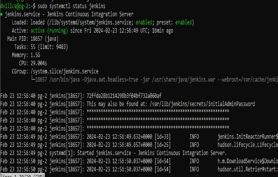
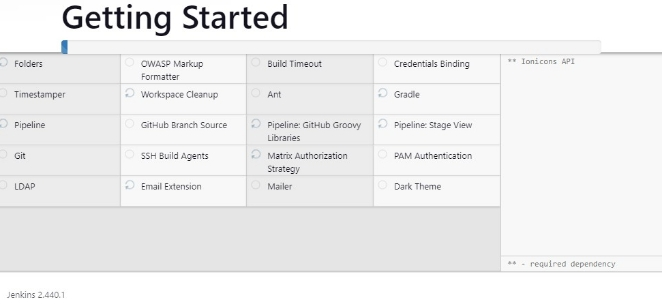
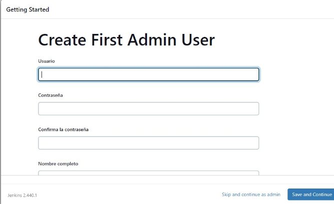

**JENKINS**

**¿QUÉ ES JENKINS?**

Jenkins una herramienta de código abierto utilizada para los procesos de integración continua que se encarga de la compilación y prueba de proyectos de software.


Jenkins es un servidor de automatización y cuenta con una amplia cantidad de complementos que permiten el respaldo de los procesos de implementación, desarrollo y automatización de los proyectos de software.

**CARACTERÍSTICAS DE JENKINS**

- Se destaca su utilidad para la integración continua, debido a sus propiedades de automatización.
- Multiplataforma.
- Permite acceso a través de la interfaz web.
- Fácil implementación y manejo.
- Escrito en lenguaje Java, el cual es un lenguaje de programación reconocido y común.

Estas características permiten que Jenkins contribuya a la aceleración del ciclo de desarrollo, gracias a sus funcionalidades entregadas a los usuarios.

Jenkins se encarga de labores relacionadas a la automatización de pruebas y despliegue, lo que se traduce en un ahorro del tiempo que se utiliza para llevar estas actividades de forma manual, así como una disminución de los errores en estos procesos.

Otra de las características de Jenkins es la propiedad de que cada commit o confirmación de cambios se desarrolla y verifica. Esto implica que los desarrolladores podrán enfocarse en un determinado commit para encargarse de la corrección de un error, en lugar de comprobar el código completo.

La arquitectura de complementos o plugins de Jenkins también se caracteriza por permitir su ampliación, por lo que el servidor puede extender las funciones ofrecidas.

**¿QUÉ ES EL DESPLIEGUE CONTINUO?**

Es una práctica que se enfoca en automatizar la entrega de software de manera constante y confiable. A diferencia de los enfoques tradicionales, donde la entrega de software implica largos ciclos de desarrollo y una intervención humana significativa, el despliegue continuo busca eliminar la fricción y acelerar el proceso.

**Integración continua**

Es una práctica de fusionar y verificar el código desarrollado por múltiples miembros del equipo de desarrollo de forma regular y automática. Esto asegura que los cambios se integren sin conflictos y se detecten errores rápidamente, lo que reduce la carga de trabajo y mejora la calidad del software.

**Entrega continua**

Consiste en automatizar la entrega de software a un entorno de prueba o producción siempre que haya cambios aprobados y verificados en el código fuente. Lo que significa que el software está listo para implementarse en cualquier momento, lo que reduce significativamente el tiempo entre el desarrollo y la entrega a los usuarios finales.

El proceso de despliegue continuo, de manera general se constituye de las siguientes etapas.

1. Control de versiones
1. Integración continua
1. Pruebas automáticas
1. Entrega automatizada
1. Monitoreo y retroalimentación
1. Retroalimentación y mejoras

**ARQUITECTURA DE JENKINS**

Los elementos principales de la arquitectura de Jenkins son: los nodos principales y los agentes.

**Nodos principales**

Al referirnos a los nodos principales se habla de un servidor principal que incluye las configuraciones de gran importancia y que se encarga de mantener el orden del flujo de trabajo, controlando labores como la monitorización de procesos o la programación de un job, entre otros.

**Agentes**

Son un tipo de nodo que se encarga de la ejecución de los pasos de un job en el sistema. Esto implica que, cada vez que se crea un job en Jenkins, debe asignarse un determinado agente que incluya una etiqueta identificadora.

**Persistencia**

Jenkins usa el sistema de archivos para almacenar sus datos. Los directorios se crean en el interior $JENKINS\_HOME de una manera que modela la estructura del modelo de objetos. Algunos datos, como la salida de la consola, se almacenan como archivos de texto sin formato, otros se almacenan como archivos de propiedades de Java. Pero la mayoría de los datos estructurados, como cómo se configura un proyecto o varios registros de la compilación, se conservan mediante XStream.

En Linux, Jenkis se almacena por defecto en el siguiente directorio: /var/lib/jenkins.

**Complementos**

El modelo de objetos de Jenkins es extensible y amplían las capacidades de Jenkins.

Jenkins carga cada complemento en un cargador de clases independiente para evitar conflictos. Luego, los complementos pueden participar en las actividades del sistema tal como lo hacen otras clases integradas de Jenkins. Pueden participar en la persistencia basada en XStream, pueden proporcionar "vistas" mediante Jelly, pueden proporcionar recursos estáticos como imágenes y, desde el punto de vista de los usuarios, todo funciona a la perfección. No hay distinción entre las funcionalidades integradas y las de los complementos.

**Diagrama de flujo de datos**

**JOB EN JENKINS**

Un Job en Jenkins es una descripción configurada por el cliente, acerca del trabajo que debe ser llevado en el sistema, como puede ser el crear una pieza determinada de software, entre otros.

Los Jobs pueden crearse o construirse con el objetivo de probar el proyecto de software o aplicación del usuario.

Tipos de Jobs en Jenkins:

- **Pipeline:** este recurso destaca por su capacidad de demostrar labores con prolongada ejecución, incluyendo múltiples agentes de compilación de Jenkins.
- **Freestyle Proyect:** es un job en Jenkins que se caracteriza por no tener restricciones para diversas operaciones, como la ejecución de un script, una compilación o build, entre otros.
- **Multi-configuration Project:** se refiere a la opción ideal para el trabajo en situaciones donde se necesiten múltiples configuraciones, como pueden ser compilaciones determinadas del servidor de Jenkins.

**INSTALACIÓN DE JENKINS**

Jenkins está escrito en Java, por lo que se debe tenerlo instalado en el sistema operativo previamente.

En el sistema operativo Debian se siguen los siguientes pasos para la instalación. Estas instrucciones fueron recopiladas de la documentación disponible en el sitio web de Jenkins y se realizan mediante línea de comandos.

- Instalar Java

``` sudo apt install fontconfig openjdk-17-jre ```

- Instalar Jenkins

```
sudo wget -O /usr/share/keyrings/jenkins-keyring.asc \

https://pkg.jenkins.io/debian/jenkins.io-2023.key

echo deb [signed-by=/usr/share/keyrings/jenkins-keyring.asc] \

https://pkg.jenkins.io/debian binary/ | sudo tee \

/etc/apt/sources.list.d/jenkins.list > /dev/null

sudo apt-get update

sudo apt-get install Jenkins 
```

- Habilitar Jenkins
```
sudo systemctl enable jenkins

sudo systemctl start jenkins

sudo systemctl status Jenkins
```

- Como resultado del comando status se entrega una contraseña que nos sirve para iniciar sesión en el servidor de Jenkins por primera vez y realizar la configuración de un primer usuario administrador. En este caso 72ffda28…

  

- En un navegador ingresar a Jenkins mediante la dirección: localhost:8080; y realizar la configuración inicial usando la contraseña del anterior paso.


- En la configuración inicial, elegir o no la instalación de plugins recomendados.



- Realizar la configuración del usuario administrador




